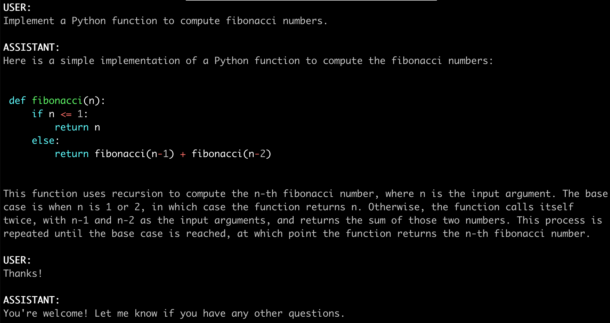
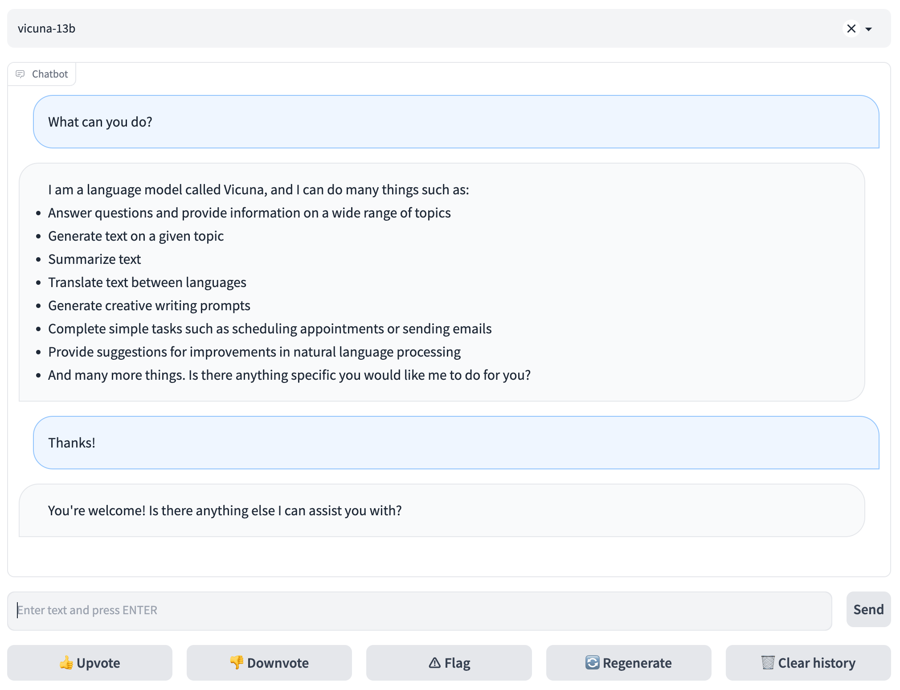

# FastChat
| [**Demo**](https://chat.lmsys.org/) | [**Discord**](https://discord.gg/HSWAKCrnFx) | [**X**](https://x.com/lmsysorg) |

FastChat is an open platform for training, serving, and evaluating large language model based chatbots.
- FastChat powers Chatbot Arena (https://chat.lmsys.org/), serving over 10 million chat requests for 70+ LLMs.
- Chatbot Arena has collected over 500K human votes from side-by-side LLM battles to compile an online [LLM Elo leaderboard](https://leaderboard.lmsys.org).

FastChat's core features include:
- The training and evaluation code for state-of-the-art models (e.g., Vicuna, MT-Bench).
- A distributed multi-model serving system with web UI and OpenAI-compatible RESTful APIs.

## News
- [2024/03] 🔥 We released Chatbot Arena technical [report](https://arxiv.org/abs/2403.04132).
- [2023/09] We released **LMSYS-Chat-1M**, a large-scale real-world LLM conversation dataset. Read the [report](https://arxiv.org/abs/2309.11998).
- [2023/08] We released **Vicuna v1.5** based on Llama 2 with 4K and 16K context lengths. Download [weights](#vicuna-weights).
- [2023/07] We released **Chatbot Arena Conversations**, a dataset containing 33k conversations with human preferences. Download it [here](https://huggingface.co/datasets/lmsys/chatbot_arena_conversations).

<details>
<summary>More</summary>

- [2023/08] We released **LongChat v1.5** based on Llama 2 with 32K context lengths. Download [weights](#longchat).
- [2023/06] We introduced **MT-bench**, a challenging multi-turn question set for evaluating chatbots. Check out the blog [post](https://lmsys.org/blog/2023-06-22-leaderboard/).
- [2023/06] We introduced **LongChat**, our long-context chatbots and evaluation tools. Check out the blog [post](https://lmsys.org/blog/2023-06-29-longchat/).
- [2023/05] We introduced **Chatbot Arena** for battles among LLMs. Check out the blog [post](https://lmsys.org/blog/2023-05-03-arena).
- [2023/03] We released **Vicuna: An Open-Source Chatbot Impressing GPT-4 with 90% ChatGPT Quality**. Check out the blog [post](https://vicuna.lmsys.org).

</details>

<a href="https://chat.lmsys.org"></a>

## Contents
- [Install](#install)
- [Model Weights](#model-weights)
- [Inference with Command Line Interface](#inference-with-command-line-interface)
- [Serving with Web GUI](#serving-with-web-gui)
- [API](#api)
- [Evaluation](#evaluation)
- [Fine-tuning](#fine-tuning)
- [Citation](#citation)

## Install

### Method 1: With pip

```bash
pip3 install "fschat[model_worker,webui]"
```

### Method 2: From source

1. Clone this repository and navigate to the FastChat folder
```bash
git clone https://github.com/lm-sys/FastChat.git
cd FastChat
```

If you are running on Mac:
```bash
brew install rust cmake
```

2. Install Package
```bash
pip3 install --upgrade pip  # enable PEP 660 support
pip3 install -e ".[model_worker,webui]"
```

## Model Weights
### Vicuna Weights
[Vicuna](https://lmsys.org/blog/2023-03-30-vicuna/) is based on Llama 2 and should be used under Llama's [model license](https://github.com/facebookresearch/llama/blob/main/LICENSE).

You can use the commands below to start chatting. It will automatically download the weights from Hugging Face repos.
Downloaded weights are stored in a `.cache` folder in the user's home folder (e.g., `~/.cache/huggingface/hub/<model_name>`).

See more command options and how to handle out-of-memory in the "Inference with Command Line Interface" section below.

**NOTE: `transformers>=4.31` is required for 16K versions.**

| Size | Chat Command | Hugging Face Repo |
| ---  | --- | --- |
| 7B   | `python3 -m fastchat.serve.cli --model-path lmsys/vicuna-7b-v1.5`  | [lmsys/vicuna-7b-v1.5](https://huggingface.co/lmsys/vicuna-7b-v1.5)   |
| 7B-16k   | `python3 -m fastchat.serve.cli --model-path lmsys/vicuna-7b-v1.5-16k`  | [lmsys/vicuna-7b-v1.5-16k](https://huggingface.co/lmsys/vicuna-7b-v1.5-16k)   |
| 13B  | `python3 -m fastchat.serve.cli --model-path lmsys/vicuna-13b-v1.5` | [lmsys/vicuna-13b-v1.5](https://huggingface.co/lmsys/vicuna-13b-v1.5) |
| 13B-16k  | `python3 -m fastchat.serve.cli --model-path lmsys/vicuna-13b-v1.5-16k` | [lmsys/vicuna-13b-v1.5-16k](https://huggingface.co/lmsys/vicuna-13b-v1.5-16k) |
| 33B  | `python3 -m fastchat.serve.cli --model-path lmsys/vicuna-33b-v1.3` | [lmsys/vicuna-33b-v1.3](https://huggingface.co/lmsys/vicuna-33b-v1.3) |

**Old weights**: see [docs/vicuna_weights_version.md](docs/vicuna_weights_version.md) for all versions of weights and their differences.

### Other Models
Besides Vicuna, we also released two additional models: [LongChat](https://lmsys.org/blog/2023-06-29-longchat/) and FastChat-T5.
You can use the commands below to chat with them. They will automatically download the weights from Hugging Face repos.

| Model | Chat Command | Hugging Face Repo |
| ---  | --- | --- |
| LongChat-7B   | `python3 -m fastchat.serve.cli --model-path lmsys/longchat-7b-32k-v1.5`  | [lmsys/longchat-7b-32k](https://huggingface.co/lmsys/longchat-7b-32k-v1.5)   |
| FastChat-T5-3B   | `python3 -m fastchat.serve.cli --model-path lmsys/fastchat-t5-3b-v1.0`  | [lmsys/fastchat-t5-3b-v1.0](https://huggingface.co/lmsys/fastchat-t5-3b-v1.0) |

## Inference with Command Line Interface

<a href="https://chat.lmsys.org"></a>

(Experimental Feature: You can specify `--style rich` to enable rich text output and better text streaming quality for some non-ASCII content. This may not work properly on certain terminals.)

#### Supported Models
FastChat supports a wide range of models, including
LLama 2, Vicuna, Alpaca, Baize, ChatGLM, Dolly, Falcon, FastChat-T5, GPT4ALL, Guanaco, MTP, OpenAssistant, OpenChat, RedPajama, StableLM, WizardLM, xDAN-AI and more.

See a complete list of supported models and instructions to add a new model [here](docs/model_support.md).

#### Single GPU
The command below requires around 14GB of GPU memory for Vicuna-7B and 28GB of GPU memory for Vicuna-13B.
See the ["Not Enough Memory" section](#not-enough-memory) below if you do not have enough memory.
`--model-path` can be a local folder or a Hugging Face repo name.
```
python3 -m fastchat.serve.cli --model-path lmsys/vicuna-7b-v1.5
```

#### Multiple GPUs
You can use model parallelism to aggregate GPU memory from multiple GPUs on the same machine. 
```
python3 -m fastchat.serve.cli --model-path lmsys/vicuna-7b-v1.5 --num-gpus 2
```

Tips:
Sometimes the "auto" device mapping strategy in huggingface/transformers does not perfectly balance the memory allocation across multiple GPUs.
You can use `--max-gpu-memory` to specify the maximum memory per GPU for storing model weights.
This allows it to allocate more memory for activations, so you can use longer context lengths or larger batch sizes. For example,

```
python3 -m fastchat.serve.cli --model-path lmsys/vicuna-7b-v1.5 --num-gpus 2 --max-gpu-memory 8GiB
```

#### CPU Only
This runs on the CPU only and does not require GPU. It requires around 30GB of CPU memory for Vicuna-7B and around 60GB of CPU memory for Vicuna-13B.
```
python3 -m fastchat.serve.cli --model-path lmsys/vicuna-7b-v1.5 --device cpu
```

Use Intel AI Accelerator AVX512_BF16/AMX to accelerate CPU inference.
```
CPU_ISA=amx python3 -m fastchat.serve.cli --model-path lmsys/vicuna-7b-v1.5 --device cpu
```

#### Metal Backend (Mac Computers with Apple Silicon or AMD GPUs)
Use `--device mps` to enable GPU acceleration on Mac computers (requires torch >= 2.0).
Use `--load-8bit` to turn on 8-bit compression.
```
python3 -m fastchat.serve.cli --model-path lmsys/vicuna-7b-v1.5 --device mps --load-8bit
```
Vicuna-7B can run on a 32GB M1 Macbook with 1 - 2 words / second.

#### Intel XPU (Intel Data Center and Arc A-Series GPUs)
Install the [Intel Extension for PyTorch](https://intel.github.io/intel-extension-for-pytorch/xpu/latest/tutorials/installation.html). Set the OneAPI environment variables:
```
source /opt/intel/oneapi/setvars.sh
```

Use `--device xpu` to enable XPU/GPU acceleration.
```
python3 -m fastchat.serve.cli --model-path lmsys/vicuna-7b-v1.5 --device xpu
```
Vicuna-7B can run on an Intel Arc A770 16GB.

#### Ascend NPU
Install the [Ascend PyTorch Adapter](https://github.com/Ascend/pytorch). Set the CANN environment variables:
```
source /usr/local/Ascend/ascend-toolkit/set_env.sh
```

Use `--device npu` to enable NPU acceleration.
```
python3 -m fastchat.serve.cli --model-path lmsys/vicuna-7b-v1.5 --device npu
```
Vicuna-7B/13B can run on an Ascend NPU.

#### Not Enough Memory
If you do not have enough memory, you can enable 8-bit compression by adding `--load-8bit` to commands above.
This can reduce memory usage by around half with slightly degraded model quality.
It is compatible with the CPU, GPU, and Metal backend.

Vicuna-13B with 8-bit compression can run on a single GPU with 16 GB of VRAM, like an Nvidia RTX 3090, RTX 4080, T4, V100 (16GB), or an AMD RX 6800 XT.

```
python3 -m fastchat.serve.cli --model-path lmsys/vicuna-7b-v1.5 --load-8bit
```

In addition to that, you can add `--cpu-offloading` to commands above to offload weights that don't fit on your GPU onto the CPU memory.
This requires 8-bit compression to be enabled and the bitsandbytes package to be installed, which is only available on linux operating systems.

#### More Platforms and Quantization
- For AMD GPU users, please install ROCm and [the ROCm version of PyTorch](https://pytorch.org/get-started/locally/) before you install FastChat. See also this [post](https://github.com/lm-sys/FastChat/issues/104#issuecomment-1613791563).
- FastChat supports ExLlama V2. See [docs/exllama_v2.md](/docs/exllama_v2.md).
- FastChat supports GPTQ 4bit inference with [GPTQ-for-LLaMa](https://github.com/qwopqwop200/GPTQ-for-LLaMa). See [docs/gptq.md](/docs/gptq.md).
- FastChat supports AWQ 4bit inference with [mit-han-lab/llm-awq](https://github.com/mit-han-lab/llm-awq). See [docs/awq.md](/docs/awq.md).
- [MLC LLM](https://mlc.ai/mlc-llm/), backed by [TVM Unity](https://github.com/apache/tvm/tree/unity) compiler, deploys Vicuna natively on phones, consumer-class GPUs and web browsers via Vulkan, Metal, CUDA and WebGPU.

#### Use models from modelscope
For Chinese users, you can use models from www.modelscope.cn via specify the following environment variables.
```bash
export FASTCHAT_USE_MODELSCOPE=True
```

## Serving with Web GUI

<a href="https://chat.lmsys.org"></a>

To serve using the web UI, you need three main components: web servers that interface with users, model workers that host one or more models, and a controller to coordinate the webserver and model workers. You can learn more about the architecture [here](docs/server_arch.md).

Here are the commands to follow in your terminal:

#### Launch the controller
```bash
python3 -m fastchat.serve.controller
```

This controller manages the distributed workers.

#### Launch the model worker(s)
```bash
python3 -m fastchat.serve.model_worker --model-path lmsys/vicuna-7b-v1.5
```
Wait until the process finishes loading the model and you see "Uvicorn running on ...". The model worker will register itself to the controller .

To ensure that your model worker is connected to your controller properly, send a test message using the following command:
```bash
python3 -m fastchat.serve.test_message --model-name vicuna-7b-v1.5
```
You will see a short output.

#### Launch the Gradio web server
```bash
python3 -m fastchat.serve.gradio_web_server
```

This is the user interface that users will interact with.

By following these steps, you will be able to serve your models using the web UI. You can open your browser and chat with a model now.
If the models do not show up, try to reboot the gradio web server.

#### (Optional): Advanced Features, Scalability, Third Party UI
- You can register multiple model workers to a single controller, which can be used for serving a single model with higher throughput or serving multiple models at the same time. When doing so, please allocate different GPUs and ports for different model workers.
```
# worker 0
CUDA_VISIBLE_DEVICES=0 python3 -m fastchat.serve.model_worker --model-path lmsys/vicuna-7b-v1.5 --controller http://localhost:21001 --port 31000 --worker http://localhost:31000
# worker 1
CUDA_VISIBLE_DEVICES=1 python3 -m fastchat.serve.model_worker --model-path lmsys/fastchat-t5-3b-v1.0 --controller http://localhost:21001 --port 31001 --worker http://localhost:31001
```
- You can also launch a multi-tab gradio server, which includes the Chatbot Arena tabs.
```bash
python3 -m fastchat.serve.gradio_web_server_multi
```
- The default model worker based on huggingface/transformers has great compatibility but can be slow. If you want high-throughput batched serving, you can try [vLLM integration](docs/vllm_integration.md).
- If you want to host it on your own UI or third party UI, see [Third Party UI](docs/third_party_ui.md).

## API
### OpenAI-Compatible RESTful APIs & SDK
FastChat provides OpenAI-compatible APIs for its supported models, so you can use FastChat as a local drop-in replacement for OpenAI APIs.
The FastChat server is compatible with both [openai-python](https://github.com/openai/openai-python) library and cURL commands.
The REST API is capable of being executed from Google Colab free tier, as demonstrated in the [FastChat_API_GoogleColab.ipynb](https://github.com/lm-sys/FastChat/blob/main/playground/FastChat_API_GoogleColab.ipynb) notebook, available in our repository.
See [docs/openai_api.md](docs/openai_api.md).

### Hugging Face Generation APIs
See [fastchat/serve/huggingface_api.py](fastchat/serve/huggingface_api.py).

### LangChain Integration
See [docs/langchain_integration](docs/langchain_integration.md).

## Evaluation
We use MT-bench, a set of challenging multi-turn open-ended questions to evaluate models. 
To automate the evaluation process, we prompt strong LLMs like GPT-4 to act as judges and assess the quality of the models' responses.
See instructions for running MT-bench at [fastchat/llm_judge](fastchat/llm_judge).

MT-bench is the new recommended way to benchmark your models. If you are still looking for the old 80 questions used in the vicuna blog post, please go to [vicuna-blog-eval](https://github.com/lm-sys/vicuna-blog-eval).

## Fine-tuning
### Data

Vicuna is created by fine-tuning a Llama base model using approximately 125K user-shared conversations gathered from ShareGPT.com with public APIs. To ensure data quality, we convert the HTML back to markdown and filter out some inappropriate or low-quality samples. Additionally, we divide lengthy conversations into smaller segments that fit the model's maximum context length. For detailed instructions to clean the ShareGPT data, check out [here](docs/commands/data_cleaning.md).

We will not release the ShareGPT dataset. If you would like to try the fine-tuning code, you can run it with some dummy conversations in [dummy_conversation.json](data/dummy_conversation.json). You can follow the same format and plug in your own data.

### Code and Hyperparameters
Our code is based on [Stanford Alpaca](https://github.com/tatsu-lab/stanford_alpaca) with additional support for multi-turn conversations.
We use similar hyperparameters as the Stanford Alpaca.

| Hyperparameter | Global Batch Size | Learning rate | Epochs | Max length | Weight decay |
| --- | ---: | ---: | ---: | ---: | ---: |
| Vicuna-13B | 128 | 2e-5 | 3 | 2048 | 0 |

### Fine-tuning Vicuna-7B with Local GPUs

- Install dependency
```bash
pip3 install -e ".[train]"
```

- You can use the following command to train Vicuna-7B with 4 x A100 (40GB). Update `--model_name_or_path` with the actual path to Llama weights and `--data_path` with the actual path to data.
```bash
torchrun --nproc_per_node=4 --master_port=20001 fastchat/train/train_mem.py \
    --model_name_or_path meta-llama/Llama-2-7b-hf \
    --data_path data/dummy_conversation.json \
    --bf16 True \
    --output_dir output_vicuna \
    --num_train_epochs 3 \
    --per_device_train_batch_size 2 \
    --per_device_eval_batch_size 2 \
    --gradient_accumulation_steps 16 \
    --evaluation_strategy "no" \
    --save_strategy "steps" \
    --save_steps 1200 \
    --save_total_limit 10 \
    --learning_rate 2e-5 \
    --weight_decay 0. \
    --warmup_ratio 0.03 \
    --lr_scheduler_type "cosine" \
    --logging_steps 1 \
    --fsdp "full_shard auto_wrap" \
    --fsdp_transformer_layer_cls_to_wrap 'LlamaDecoderLayer' \
    --tf32 True \
    --model_max_length 2048 \
    --gradient_checkpointing True \
    --lazy_preprocess True
```

Tips:
- If you are using V100 which is not supported by FlashAttention, you can use the [memory-efficient attention](https://arxiv.org/abs/2112.05682) implemented in [xFormers](https://github.com/facebookresearch/xformers). Install xformers and replace `fastchat/train/train_mem.py` above with [fastchat/train/train_xformers.py](fastchat/train/train_xformers.py).
- If you meet out-of-memory due to "FSDP Warning: When using FSDP, it is efficient and recommended... ", see solutions [here](https://github.com/huggingface/transformers/issues/24724#issuecomment-1645189539).
- If you meet out-of-memory during model saving, see solutions [here](https://github.com/pytorch/pytorch/issues/98823).
- To turn on logging to popular experiment tracking tools such as Tensorboard, MLFlow or Weights & Biases, use the `report_to` argument, e.g. pass `--report_to wandb` to turn on logging to Weights & Biases.

### Other models, platforms and LoRA support
More instructions to train other models (e.g., FastChat-T5) and use LoRA are in [docs/training.md](docs/training.md).

### Fine-tuning on Any Cloud with SkyPilot
[SkyPilot](https://github.com/skypilot-org/skypilot) is a framework built by UC Berkeley for easily and cost effectively running ML workloads on any cloud (AWS, GCP, Azure, Lambda, etc.).
Find SkyPilot documentation [here](https://github.com/skypilot-org/skypilot/tree/master/llm/vicuna) on using managed spot instances to train Vicuna and save on your cloud costs.

## Citation
The code (training, serving, and evaluation) in this repository is mostly developed for or derived from the paper below.
Please cite it if you find the repository helpful.

```
@misc{zheng2023judging,
      title={Judging LLM-as-a-judge with MT-Bench and Chatbot Arena},
      author={Lianmin Zheng and Wei-Lin Chiang and Ying Sheng and Siyuan Zhuang and Zhanghao Wu and Yonghao Zhuang and Zi Lin and Zhuohan Li and Dacheng Li and Eric. P Xing and Hao Zhang and Joseph E. Gonzalez and Ion Stoica},
      year={2023},
      eprint={2306.05685},
      archivePrefix={arXiv},
      primaryClass={cs.CL}
}
```

We are also planning to add more of our research to this repository.
