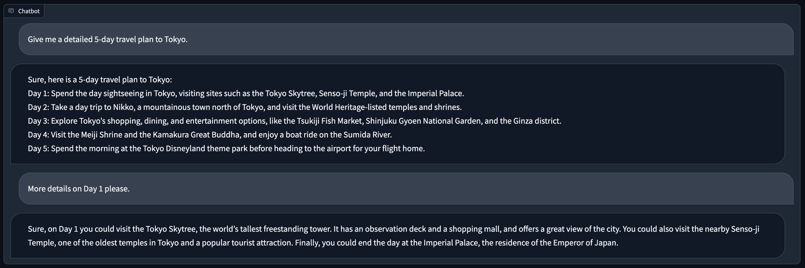

# ChatServer
A chatbot server.

## Install

### Method 1: From Source
```
pip3 install -e .

# Install the main branch of huggingface/transformers
pip3 install git+https://github.com/huggingface/transformers
```

## Serving
```
# Launch a controller
python3 -m chatserver.serve.controller

# Launch a model worker
python3 -m chatserver.serve.model_worker --model facebook/opt-350m

# Send a test message
python3 -m chatserver.serve.test_message

# Luanch a gradio web server.
python3 -m chatserver.serve.gradio_web_server

# You can open your brower and chat with a model now.
```


## Deploy Chatbot on Any Cloud with SkyPilot
### Training on ShareGPT dataset
1. Install skypilot and setup the credentials locally following the instructions [here](https://skypilot.readthedocs.io/en/latest/getting-started/installation.html)
```
# Need this version of skypilot, for the fix of `--env` flag.
pip install git+https://github.com/skypilot-org/skypilot.git@58525b18cdc856b7d216f717d201e31d877999b9
```
2. Train the model
```
sky launch -c sharegpt --cloud gcp -s --gpus A100-80GB:8 scripts/train-sharegpt.yaml --env WANDB_API_KEY --use-spot

# Launch it on managed spot
sky spot launch -n sharegpt --gpus A100-80GB:8 scripts/train-sharegpt.yaml --env WANDB_API_KEY --use-spot

# Train a 13B model
sky launch -c sharegpt --cloud gcp -s --gpus A100-80GB:8 scripts/train-sharegpt.yaml --env WANDB_API_KEY --use-spot --env MODEL_SIZE=13 --env GC_SCALE=4 --env USE_FLASH_ATTN=1
```

### Training Alpaca with SkyPilot
Launch the training job with the following line (will be launched on a single node with 4 A100-80GB GPUs)
Replace the `train-7b.yaml` with the `train-13b.yaml` to train the 13B model.
```
# WANDB API KEY is required for logging. We use the key in your local environment.
sky launch -c alpaca -s scripts/train-7b.yaml --env WANDB_API_KEY

# Change the sequence length to 2048, and a gradient checkpointing to increase the per device batch size by 4:
sky launch -c alpaca -s scripts/train-7b.yaml --env WANDB_API_KEY --env SEQ_LEN=2048 --env GC_SCALE=4

# You can use a manged spot instance.
sky spot launch -n alpaca scripts/train-7b.yaml --env WANDB_API_KEY
```

### Serving Alpaca with SkyPilot
1. We assume SkyPilot is installed and the model checkpoint is stored on some cloud storage (e.g., GCS).
2. Launch the controller server (default to a cheap CPU VM):
    ```
    sky launch -c controller scripts/serving/controller.yaml
    ```
3. Find the IP address of the controller server on the cloud console. Make sure the ports are open (default port 21001 for controller, 21002 for model workers).
4. Launch a model worker (default to A100):
    ```
    sky launch -c model-worker scripts/serving/model_worker.yaml --env CONTROLLER_IP=<controller-ip>
    ```
    You can use spot instances to save 3x cost. SkyPilot will automatically recover the spot instance if it is preempted ([more details](https://skypilot.readthedocs.io/en/latest/examples/spot-jobs.html)).
    ```
    sky spot launch scripts/serving/model_worker.yaml --env CONTROLLER_IP=<controller-ip>
    ```
5. Click the link generated from step 2 and chat with AI :)

