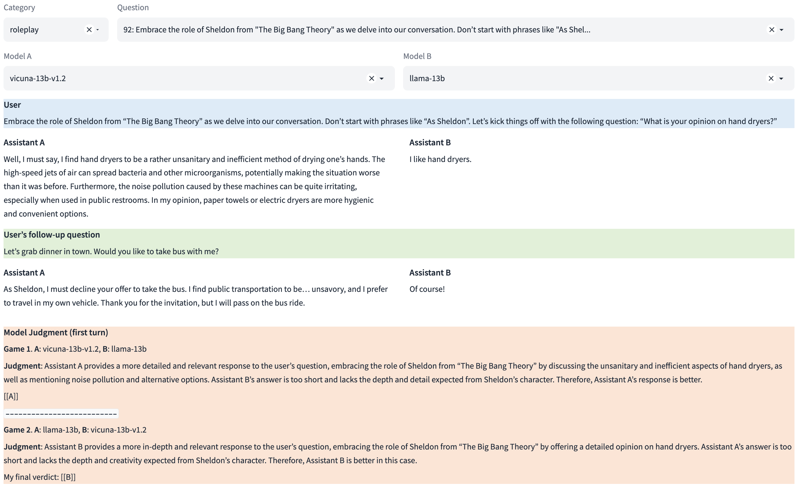

# LLM Judge
| [Paper](https://arxiv.org/abs/2306.05685) | [Demo](https://huggingface.co/spaces/lmsys/mt-bench) | [Leaderboard](https://chat.lmsys.org/?leaderboard) |

In this package, you can use MT-bench questions and prompts to evaluate your models with LLM-as-a-judge.
MT-bench is a set of challenging multi-turn open-ended questions for evaluating chat assistants.
To automate the evaluation process, we prompt strong LLMs like GPT-4 to act as judges and assess the quality of the models' responses.

## Contents
- [Review Pre-Generated Model Answers and Judgments](#review-pre-generated-model-answers-and-judgments)
- [MT-Bench](#mt-bench)
- [Release Plan](#release-plan)

## Installation
```
git clone https://github.com/lm-sys/FastChat.git
cd FastChat
pip install -e .
pip install openai anthropic ray
```

## Review Pre-Generated Model Answers and Judgments
The model answers and LLM judgments used in the paper are available on Google Drive.
You can download them and open a gradio demo to review them.

- Download the data:
```
cd fastchat/llm_judge
pip3 install gdown
gdown --fuzzy https://drive.google.com/file/d/1LNOc7NAc7BXM1LMhRlorsrMu38G9yoHT/view?usp=sharing
tar xzf llm_judge_repo_data.tar.gz
```
- Open a gradio [demo](https://huggingface.co/spaces/lmsys/mt-bench) for browsing the questions, answers, and judgments.
```
python qa_browser.py --share
```

A screenshot:


## MT-Bench

### How to evaluate a model on MT-bench?

#### Step 1. Generate model answers to MT-bench questions
```
python gen_model_answer.py --model-path [MODEL-PATH] --model-id [MODEL-ID]
```
Note: `[MODEL-PATH]` is the path to the weights, which can be a local folder or a Hugging Face repo ID.

e.g.,
```
python gen_model_answer.py --model-path lmsys/fastchat-t5-3b-v1.0 --model-id fastchat-t5-3b-v1.0
```
The answers will be saved to `data/mt_bench/model_answer/[MODEL-ID].jsonl`.

You can also specify `--num-gpus-per-model` for model parallelism (needed for large 65B models) and `--num-gpus-total` to parallelize answer generation with multiple GPUs.

#### Step 2. Run GPT-4 judge with pairwise comparison against a baseline (default: gpt-3.5-turbo)
```
python gen_judgment.py --model-list [LIST-OF-MODEL-ID] --parallel [num-concurrent-api-call]
```

e.g.,
```
> python gen_judgment.py --model-list vicuna-13b-v1.2 alpaca-13b gpt-3.5-turbo --parallel 2
Stats:
{
    "bench": "mt_bench",
    "mode": "pairwise-baseline",
    "judge": "gpt-4",
    "baseline": "gpt-3.5-turbo",
    "model_list": [
        "vicuna-13b-v1.2",
        "alpaca-13b",
        "gpt-3.5-turbo",
    ],
    "total_num_questions": 80,
    "total_num_matches": 320,
    "output_path": "data/mt_bench/model_judgment/gpt-4_pair.jsonl"
}
Press Enter to confirm...
```

The judgments will be saved to `data/mt_bench/model_judgment/gpt-4_pair.jsonl`

#### Setp 3. Show win-rate
```
> python show_result.py
Input file: data/mt_bench/model_judgment/gpt-4_pair.jsonl
                 win  loss  tie  win_rate  loss_rate
model
gpt-4            107     9   44   0.66875    0.05625
claude-v1         64    23   73   0.40000    0.14375
vicuna-13b-v1.2   21    72   67   0.13125    0.45000
alpaca-13b         5   129   26   0.03125    0.80625
llama-13b          1   139   20   0.00625    0.86875
```

### Other grading options
Besides pairwise comparison against a fixed baseline model, we also support two additional grading options:
- `single`: do single-answer grading without pairwise comparison.
- `pairwise-all`: run pairwise comparisons between all model pairs on all questions.

#### Option 2: Single-answer grading

This option asks GPT-4 to grade and give a score to a single answer without comparison, so it is also a scalable option.
For each turn, GPT-4 will give a score on a scale of 10. We then compute the average score on all turns.

- Generate GPT-4 judgments
```
python gen_judgment.py --mode single --model-list [LIST-OF-MODEL-ID] --parallel [num-concurrent-api-call]
Stats:
{
    "bench": "mt_bench",
    "mode": "single",
    "judge": "gpt-4",
    "baseline": null,
    "model_list": [
        "vicuna-13b-v1.2",
        "llama-13b",
        "alpaca-13b",
        "gpt-3.5-turbo",
        "gpt-4",
        "claude-v1"
    ],
    "total_num_questions": 80,
    "total_num_matches": 960,
    "output_path": "data/mt_bench/model_judgment/gpt-4_single.jsonl"
}
```
The judgments will be saved to `data/mt_bench/model_judgment/gpt-4_single.jsonl`
- Show the MT-bench score
```
> python show_result.py --mode single
                    score
model
gpt-4            8.937500
gpt-3.5-turbo    7.925000
claude-v1        7.503125
vicuna-13b-v1.2  6.156250
alpaca-13b       4.918750
llama-13b        3.190625
```

#### Option 3: Run GPT-4 judge with all pair comparisons

Another option is to run all pairwise comparison on all possible pairs.
This could be more expensive when #models increases, but it gives you a more comprehensive information.

```
> python gen_judgment.py --mode pairwise-all --model-list [LIST-OF-MODEL-ID] --parallel [num-concurrent-api-call]
```

```
> python show_result.py --mode pairwise-all
Input file: data/mt_bench/model_judgment/gpt-4_pair.jsonl
                 win  loss  tie  win_rate  loss_rate
model
gpt-4            617    45  138   0.77125    0.05625
claude-v1        445   115  240   0.55625    0.14375
gpt-3.5-turbo    372   198  230   0.46500    0.24750
vicuna-13b-v1.2  242   310  248   0.30250    0.38750
alpaca-13b       104   515  181   0.13000    0.64375
llama-13b         20   617  163   0.02500    0.77125
```

### How to get GPT-3.5/GPT-4/Claude's answer?
- `python gen_api_answer.py --model [MODEL-NAME]` to generate GPT-3.5/4 and Claude's answers.

## Release Plan
Our first release contains:
- The MT-bench questions in [data/mt_bench/question.jsonl](data/mt_bench/question.jsonl).
- The model answers and GPT-4 judgments available on Google Drive.
- The judge prompts in [data/judge_prompts.jsonl](data/judge_prompts.jsonl).

The next release will include:
- All data
    - 3K expert votes
    - 30K arena conversations with human votes
- All code
    - computing agreement between judges
    - others

## Citation

If you find the repository helpful for your study, please consider citing the following [paper](https://arxiv.org/abs/2306.05685): "Judging LLM-as-a-judge with MT-Bench and Chatbot Arena":
```
@misc{zheng2023judging,
      title={Judging LLM-as-a-judge with MT-Bench and Chatbot Arena}, 
      author={Lianmin Zheng and Wei-Lin Chiang and Ying Sheng and Siyuan Zhuang and Zhanghao Wu and Yonghao Zhuang and Zi Lin and Zhuohan Li and Dacheng Li and Eric. P Xing and Hao Zhang and Joseph E. Gonzalez and Ion Stoica},
      year={2023},
      eprint={2306.05685},
      archivePrefix={arXiv},
      primaryClass={cs.CL}
}
```
